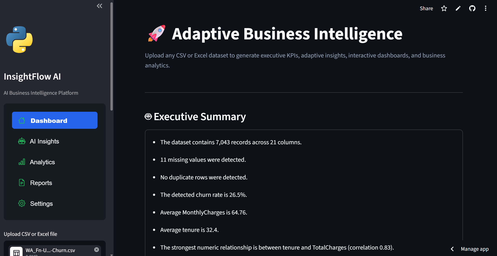
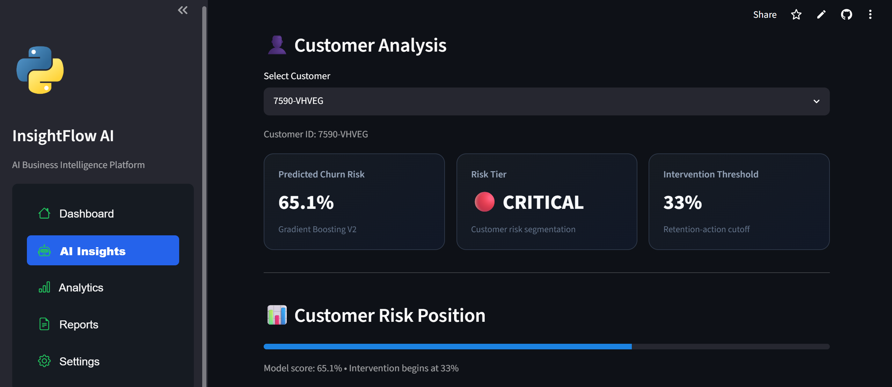
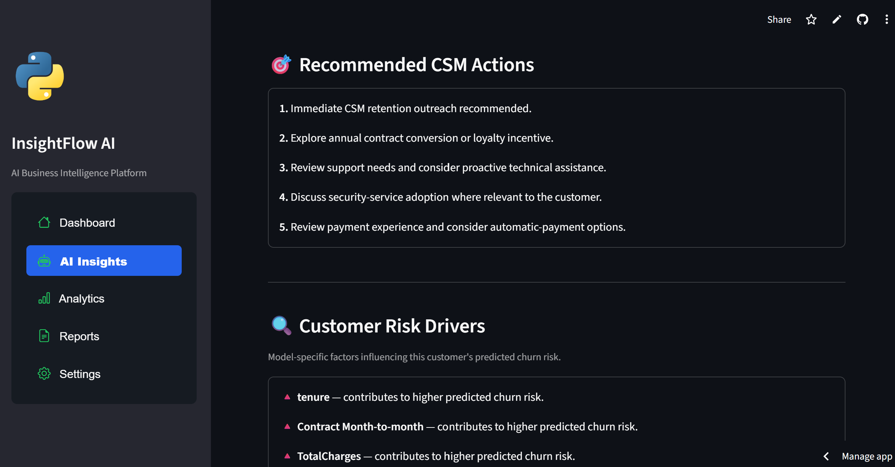
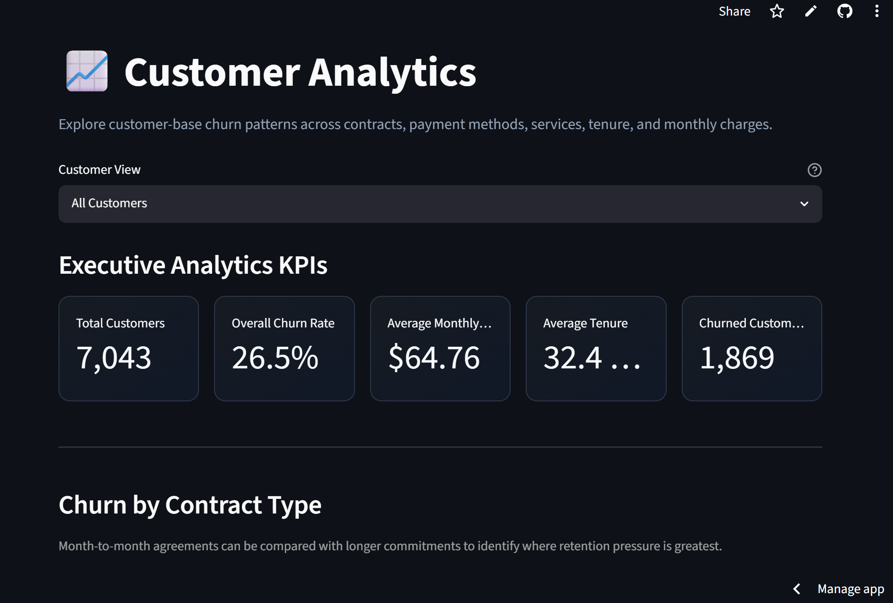
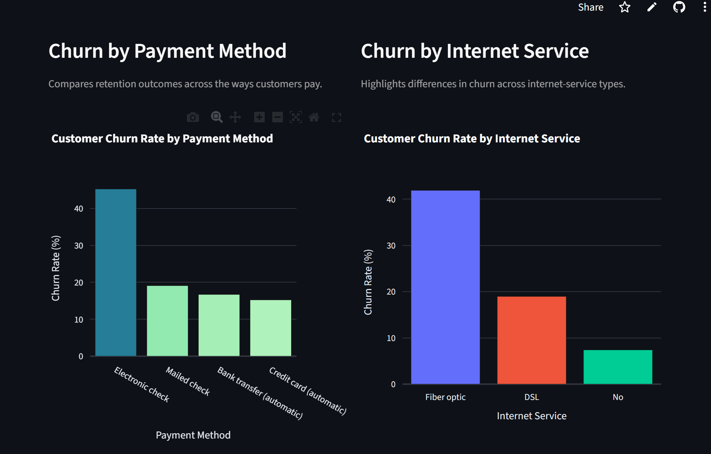
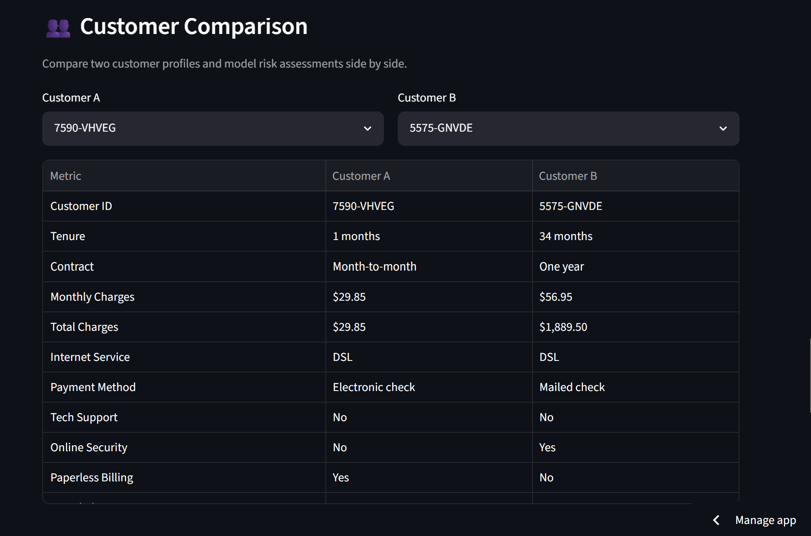
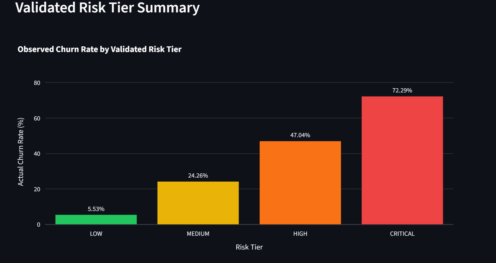
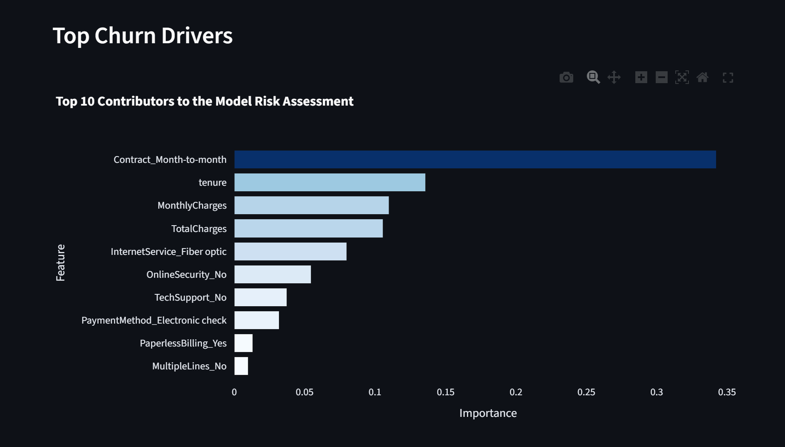

# InsightFlow AI

**Customer Churn Intelligence Platform**

An end-to-end Customer Success intelligence platform that predicts customer churn risk, explains the factors contributing to individual predictions, segments customers by risk, and converts machine-learning insights into actionable retention recommendations.

## Live Demo

> **Live Streamlit application:** [Launch InsightFlow AI](https://insightflow-customer-ai.streamlit.app/)

## Key Features

- **Adaptive Dashboard** — upload CSV or Excel data, map business fields, generate executive KPIs, profile columns, explore charts, and export cleaned data.
- **AI Insights** — select a customer and review Gradient Boosting V2 churn probability, risk tier, intervention position, SHAP drivers, and recommended CSM actions.
- **Customer Analytics** — analyze churn patterns across contracts, payment methods, internet services, tenure bands, and monthly charges.
- **Customer Comparison** — compare two customer profiles, predicted churn probabilities, risk tiers, threshold positions, and rule-based differences.
- **Executive Reports** — review portfolio KPIs, validated model metrics, risk-tier performance, top model drivers, executive findings, and CSV exports.
- **Settings** — manage session preferences for model explanations, CSM actions, and the number of displayed SHAP drivers.
- **Risk segmentation** — categorize customers as LOW, MEDIUM, HIGH, or CRITICAL risk.
- **Flexible ingestion** — supports CSV, XLSX, and XLS uploads for adaptive analysis.

## Machine Learning

The V2 churn workflow compares three classification approaches:

- Logistic Regression
- Random Forest
- Gradient Boosting

**Champion model: Gradient Boosting**

| Validated metric | Result |
|---|---:|
| Tuned cross-validation ROC-AUC | 0.8505 |
| Optimized intervention threshold | 0.33 |
| Recall at optimized threshold | 0.7258 |
| F1 at optimized threshold | 0.6411 |
| Mean calibration gap | 0.0182 |

Model selection is based on cross-validation. The intervention threshold is optimized separately to support Customer Success prioritization rather than relying only on the default classification cutoff.

## Risk Segmentation

| Risk tier | Predicted probability | Observed churn rate |
|---|---:|---:|
| LOW | < 15% | 5.53% |
| MEDIUM | 15%–33% | 24.26% |
| HIGH | 33%–60% | 47.04% |
| CRITICAL | >= 60% | 72.29% |

These validated tiers translate model probabilities into practical levels of retention attention.

## Explainability

InsightFlow AI uses SHAP for customer-level explanations. The application ranks the transformed features that contribute to predicted churn risk and identifies whether each contribution moves the prediction higher or lower.

SHAP results describe the model's assessment; they do not establish that a feature caused churn.

## Tech Stack

- Python
- Streamlit
- Pandas
- Plotly
- scikit-learn
- SHAP
- Joblib
- FastAPI
- SQLAlchemy
- SQLite
- Git and GitHub

## Architecture

```text
User / CSV / Excel
        |
        v
Streamlit UI
        |
        v
Adaptive Analytics + V2 Churn Engine
        |
        v
Gradient Boosting
        |
        v
Risk Tier + SHAP + CSM Actions
        |
        v
Analytics / Reports / Customer Comparison
```

The repository also includes a separate FastAPI, SQLAlchemy, and SQLite backend layer for database-backed customer endpoints. The primary adaptive Streamlit application loads the V2 churn pipeline directly.

For the complete production flow, model lifecycle, runtime artifacts, and supporting-component boundaries, see the [architecture documentation](architecture/README.md).

## Project Structure

```text
CustomerSuccessAI/
|-- frontend/      # Streamlit applications and adaptive analytics UI
|-- ml/            # Training, evaluation, explanations, actions, and artifacts
|-- backend/       # FastAPI endpoints, SQLAlchemy models, and database setup
|-- data/          # Runtime Telco churn dataset
|-- screenshots/   # Portfolio screenshots
|-- requirements.txt
`-- README.md
```

Main Streamlit entrypoint: `frontend/adaptive_dashboard.py`

## Running Locally

### Windows PowerShell

```powershell
python -m venv .venv
.venv\Scripts\Activate.ps1
python -m pip install -r requirements.txt
python -m streamlit run frontend/adaptive_dashboard.py
```

### macOS / Linux

```bash
python3 -m venv .venv
source .venv/bin/activate
python -m pip install -r requirements.txt
python -m streamlit run frontend/adaptive_dashboard.py
```

## Product Walkthrough

### Adaptive Business Intelligence



*Adaptive dataset ingestion and automated business intelligence generation from CSV and Excel data.*

### Customer Risk Intelligence





The AI Insights experience combines customer-level churn probability, LOW/MEDIUM/HIGH/CRITICAL risk segmentation, the 33% intervention threshold, SHAP-based risk drivers, and recommended Customer Success actions. SHAP contributions describe the model's risk assessment and are not causal conclusions.

### Customer Analytics





Portfolio analytics surface executive KPIs and churn patterns across contract types, payment methods, internet services, tenure bands, and monthly charges.

### Customer Comparison



*Side-by-side comparison of customer profiles and churn-risk characteristics.*

### Executive Reporting





Executive reporting brings together validated risk-tier performance, portfolio findings, feature importance, and downloadable reporting outputs. Feature importance reflects contribution to the model's assessment rather than causal impact.

## Business Value

InsightFlow AI helps Customer Success teams:

- prioritize customers with elevated predicted churn risk;
- interpret the model drivers contributing to individual risk assessments;
- turn risk tiers and customer attributes into practical retention actions;
- compare customer profiles and predicted risk side by side; and
- surface executive-level churn patterns across the customer portfolio.

## Disclaimer

Predictions, risk tiers, SHAP explanations, and recommendations are decision-support outputs. They should not be treated as causal conclusions or used as the sole basis for customer decisions.
