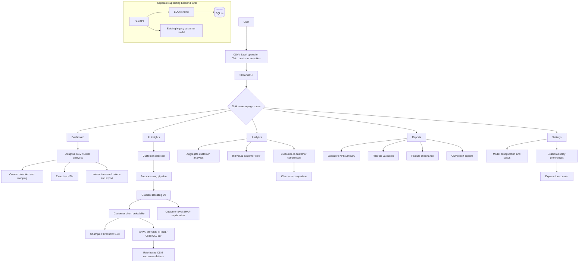
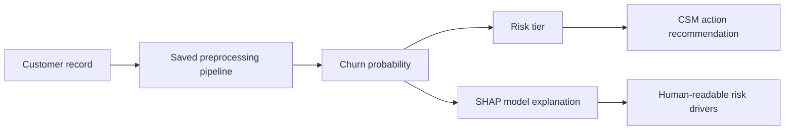
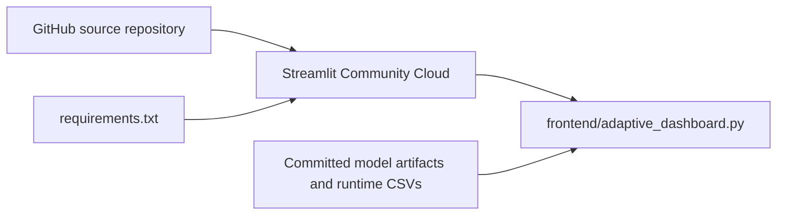

# InsightFlow AI Architecture

This document describes the current repository architecture and separates the production-facing Streamlit experience from the supporting machine-learning and backend components.

## System Overview

InsightFlow AI is an adaptive Customer Success and Business Intelligence platform built around a Streamlit frontend, adaptive CSV/Excel analytics, Gradient Boosting V2 churn prediction, customer risk segmentation, SHAP explainability, transparent Customer Success recommendations, customer analytics and comparison, and executive reporting.

The live portfolio application centers on `frontend/adaptive_dashboard.py`. It loads the trained V2 pipeline and champion configuration directly from `ml/`, uses the Telco churn dataset at runtime, and routes users between five independent product views. A FastAPI, SQLAlchemy, and SQLite application exists as a separate supporting layer; it is not the primary inference path for the deployed V2 experience.

## High-Level Architecture



## Production-Facing Streamlit Flow

### Page routing

The sidebar `option_menu` sets a single `selected` value. The bottom-level router invokes exactly one of:

- `show_dashboard()`
- `show_ai_insights()`
- `show_analytics()`
- `show_reports()`
- `show_settings()`

Shared model artifacts are cached in memory, while page-specific widgets and output remain inside their corresponding view functions.

### Dashboard: adaptive business intelligence

The Dashboard accepts CSV, XLSX, and XLS files and provides:

- safe dataframe cleaning and numeric conversion;
- automatic detection of customer, revenue, tenure, churn, contract, usage, ticket, and satisfaction fields;
- user-confirmed column mapping;
- executive summaries and dynamic KPIs;
- dataset preview and column profiling;
- numeric, categorical, churn, contract, and relationship charts; and
- cleaned CSV export.

### AI Insights: customer risk intelligence

AI Insights reads `data/WA_Fn-UseC_-Telco-Customer-Churn.csv`, allows selection of an individual customer, and sends the model-compatible record through the cached V2 pipeline.

The resulting experience combines:

1. predicted churn probability;
2. the optimized `0.33` intervention threshold from `ml/champion_config.pkl`;
3. LOW, MEDIUM, HIGH, or CRITICAL risk classification;
4. customer-level SHAP contributions from the pipeline's preprocessor and classifier; and
5. rule-based Customer Success recommendations from `ml/recommend_actions.py`.

SHAP values describe features that contribute to predicted churn risk; they are not causal conclusions.

### Analytics

The Analytics page supports three complementary views:

- **Aggregate analytics:** portfolio KPIs and churn patterns across contracts, payment methods, internet services, tenure bands, and monthly charges.
- **Individual customer view:** customer attributes plus V2 probability and risk tier when inference is available.
- **Customer comparison:** independent Customer A and Customer B selectors, side-by-side attributes, V2 risk comparison, threshold position, and rule-based non-causal differences.

### Reports

The Reports page combines:

- executive portfolio KPIs;
- champion-model validation metrics;
- observed churn rates across the four risk tiers;
- top feature importance from `ml/churn_feature_importance.csv`;
- business-oriented findings; and
- CSV downloads for executive metrics, risk tiers, and feature importance.

### Settings

Settings exposes lightweight model information and session-scoped display preferences. Streamlit session state preserves whether model explanations and recommended actions are shown and how many SHAP drivers appear.

## Runtime Data and Artifacts

| Component | Repository path | Runtime role |
|---|---|---|
| Gradient Boosting V2 pipeline | `ml/churn_model_v2.pkl` | Preprocessing and churn-probability inference |
| Champion configuration | `ml/champion_config.pkl` | Stores the selected model metadata and optimized threshold |
| Feature importance | `ml/churn_feature_importance.csv` | Supplies the Reports churn-driver visualization |
| Telco churn dataset | `data/WA_Fn-UseC_-Telco-Customer-Churn.csv` | Supplies customer selection, analytics, comparison, and reports |
| Risk/action rules | `ml/recommend_actions.py` | Converts probability into risk tier and customer attributes into CSM actions |

The Streamlit entrypoint resolves these files relative to its own location through `pathlib.Path`, keeping runtime references portable across local and hosted environments.

## Machine Learning Architecture

The V2 training workflow begins with the Telco churn dataset and performs safe data preparation before separating predictors from the observed churn label. It detects numeric and categorical columns and applies them through a scikit-learn `ColumnTransformer`:

- numeric features: median imputation followed by `StandardScaler`;
- categorical features: most-frequent imputation followed by one-hot encoding with unknown-category handling; and
- evaluation design: stratified 80/20 train/holdout split plus cross-validation on the training population.

Logistic Regression, Random Forest, and Gradient Boosting are compared and tuned. The persisted champion is the complete Gradient Boosting pipeline, so the same fitted preprocessing steps are reused during Streamlit inference.

| Champion detail | Verified value |
|---|---:|
| Model | Gradient Boosting |
| Tuned CV ROC-AUC | 0.8505 |
| Optimized intervention threshold | 0.33 |
| Recall at optimized threshold | 0.7258 |
| F1 at optimized threshold | 0.6411 |
| Mean calibration gap | 0.0182 |

The intervention threshold is selected using out-of-fold training probabilities and F1 optimization. The held-out population remains separate from this threshold search.

## Risk Intelligence Flow



| Risk tier | Probability boundary | Observed churn rate |
|---|---:|---:|
| LOW | < 15% | 5.53% |
| MEDIUM | 15% to < 33% | 24.26% |
| HIGH | 33% to < 60% | 47.04% |
| CRITICAL | >= 60% | 72.29% |

These tiers were validated by comparing model predictions with observed churn behavior. They support prioritization and should not be interpreted as causal conclusions.

## Explainability Layer

The application extracts the fitted preprocessor and Gradient Boosting classifier from the saved pipeline, transforms the selected customer record, and uses `shap.TreeExplainer` to calculate customer-level feature contributions.

The flow is:

```text
Gradient Boosting prediction
        -> SHAP customer drivers
        -> human-readable Customer Success explanation
```

The interface communicates whether a feature **contributes to predicted churn risk** in a higher or lower direction. SHAP values explain model behavior; they do not show that a customer attribute causes churn.

## Recommendation Layer

`ml/recommend_actions.py` contains the transparent rule-based decision-support layer. It combines the customer's risk tier with available customer attributes to propose actions such as:

- proactive retention outreach;
- an annual-contract or loyalty discussion;
- a technical-support review;
- a security-service adoption discussion; and
- a payment-experience or automatic-payment review.

The application presents these as recommendations for a Customer Success professional. It does not automatically execute interventions or claim that the recommended action will cause a retention outcome.

## Analytics Architecture

Analytics operates at three levels:

1. **Portfolio level** — KPIs and churn patterns across contracts, payment methods, internet services, tenure bands, and monthly charges.
2. **Individual customer level** — profile attributes, actual churn status, predicted probability, and risk tier.
3. **Customer comparison** — side-by-side tenure, contract, monthly and total charges, internet service, payment method, technical support, online security, actual churn, predicted probability, and risk tier.

The comparison layer also shows each customer's position relative to the intervention threshold and produces factual, rule-based differences without causal claims.

## Executive Reporting

The Reports page consolidates executive KPIs, the champion-model summary, validated risk-tier outcomes, global feature importance, rule-based executive findings, and CSV exports. The feature-importance report is read from `ml/churn_feature_importance.csv`; it describes contribution to the model's assessment rather than causal impact.

## Repository Structure

```text
CustomerSuccessAI/
|-- frontend/      Streamlit UI and adaptive analytics utilities
|-- ml/            Training, evaluation, explanations, rules, and artifacts
|-- backend/       Separate FastAPI, SQLAlchemy, and SQLite application
|-- data/          Runtime Telco churn dataset
|-- architecture/  Technical architecture documentation
`-- screenshots/   Portfolio product images
```

## Model Lifecycle

```mermaid
flowchart LR
    Data[Telco churn dataset] --> Prep[Numeric and categorical preprocessing]
    Prep --> Candidates[Logistic Regression vs Random Forest vs Gradient Boosting]
    Candidates --> CV[Cross-validation]
    CV --> Tune[Hyperparameter tuning]
    Tune --> Champion[Gradient Boosting champion]
    Champion --> Threshold[Intervention-threshold optimization]
    Threshold --> Calibration[Calibration validation]
    Calibration --> Explain[SHAP explainability]
    Explain --> Segments[Risk segmentation]
    Segments --> Actions[Customer Success actions]
    Actions --> Streamlit[Streamlit integration]
    Streamlit --> Deploy[Live deployment]
```



The development workflow in `ml/train_churn_v2.py` compares Logistic Regression, Random Forest, and Gradient Boosting using cross-validation, then tunes the candidate models. Gradient Boosting is persisted as the champion pipeline. Out-of-fold probabilities are used to optimize the Customer Success intervention threshold, which is stored as approximately `0.33` in `champion_config.pkl`.

Supporting scripts then evaluate calibration, derive risk tiers, generate global feature importance, and produce customer-level SHAP explanations. The deployed Streamlit application consumes the resulting artifacts; it does not retrain the model at runtime.

## Supporting and Experimental Components

### Machine-learning utilities

The `ml/` directory contains the reproducible development and analysis workflow:

- `train_churn_v2.py` — preprocessing, model comparison, tuning, champion selection, and threshold optimization;
- `evaluate_calibration.py` — calibration analysis;
- `derive_risk_tiers.py` — probability segmentation and observed tier outcomes;
- `explain_churn.py` — global feature-importance generation;
- `explain_customer.py` — command-line customer-level SHAP analysis; and
- `recommend_actions.py` — shared risk-tier and CSM recommendation rules.

These utilities support the production artifacts but are not executed by the live application during normal page rendering.

### Separate FastAPI backend

The `backend/` directory is an existing, separate application layer with:

- FastAPI endpoints for customers, health scores, and legacy prediction;
- SQLAlchemy models and sessions; and
- a local SQLite database.

The current Streamlit V2 flow does not call this backend. The backend retains its earlier customer model and should be understood as a supporting repository component rather than the serving path for the Gradient Boosting V2 experience.

## Deployment Architecture

The live portfolio deployment uses **Streamlit Community Cloud**, with **GitHub** as the source repository. Streamlit installs the Python dependencies from `requirements.txt`, starts `frontend/adaptive_dashboard.py`, and reads the committed runtime dataset and model artifacts directly from the repository checkout.

No additional cloud API, managed database, container platform, or external inference service is part of the current Streamlit deployment.



## Supporting Backend

The existing backend comprises FastAPI customer and health-score endpoints, SQLAlchemy session/model definitions, and SQLite persistence. It also retains older model-era prediction components. It is not called by the deployed Streamlit V2 inference flow and is not implied to be hosted by Streamlit Community Cloud.

## Architecture Decisions

- **Streamlit** provides rapid delivery of interactive analytics, navigation, widgets, and portfolio visualizations in one Python application.
- **scikit-learn pipelines** keep preprocessing and inference repeatable by packaging fitted transformations with the classifier.
- **Gradient Boosting** was selected through comparative cross-validation and tuning rather than assumed in advance.
- **SHAP** provides customer-level visibility into contributions to predicted risk.
- **Rule-based recommendations** keep business decision support inspectable and separate from model scoring.
- **GitHub and Streamlit Community Cloud** provide a simple portfolio deployment path using committed dependencies, data, and artifacts.

## Repository Boundaries

```text
frontend/      Production-facing Streamlit UI and earlier dashboard utilities
ml/            Training, evaluation, explainability, recommendations, and artifacts
backend/       Separate FastAPI, SQLAlchemy, and SQLite layer
data/          Runtime Telco churn dataset
screenshots/   Portfolio product imagery
architecture/  Architecture documentation
```
