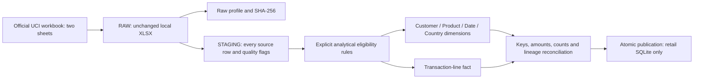

# Online Retail II: local data engineering

This independent domain prepares genuine transaction timestamps for future customer analytics. It does **not** implement RFM, cohort retention, Customer 360, lifetime value, Power BI, churn labels, or ML.

See [the measured local validation report](VALIDATION.md) for the full raw profile, exclusions, two-run counts, and benchmark results.

- **Telco:** churn prediction and snapshot customer analytics; existing files and app remain unchanged.
- **Online Retail II:** transactional analytics foundation. Its customers are unrelated to Telco customers and must never be joined to them.

## Source and acquisition

Official [UCI Online Retail II, dataset 502](https://archive.ics.uci.edu/dataset/502/online+retail+ii), Daqing Chen, DOI [10.24432/C5CG6D](https://doi.org/10.24432/C5CG6D), licensed CC BY 4.0. Unit prices are in GBP. The source is not labeled for churn.

Download the [official archive](https://archive.ics.uci.edu/static/public/502/online+retail+ii.zip), then extract `online_retail_II.xlsx` into `data/raw/`. Keep both worksheets: `Year 2009-2010` and `Year 2010-2011`. Raw and processed directories are ignored by Git. No unofficial mirrors are used.

## Execution

From the project root, using the existing environment:

```powershell
.venv\Scripts\python.exe -m etl.profile
.venv\Scripts\python.exe -m etl.run_retail_etl --report data/processed/retail_run1.json
.venv\Scripts\python.exe -m etl.run_retail_etl --report data/processed/retail_run2.json
.venv\Scripts\python.exe -m unittest discover -s tests -v
.venv\Scripts\python.exe -m compileall analytics etl frontend ml backend
.venv\Scripts\python.exe -m pip check
```

The ETL also accepts `--source`, `--database`, and `--report`. Defaults are the official workbook, `data/processed/online_retail.sqlite3`, and `data/processed/retail_quality.json`. Run from the root as a module. No new dependencies are required: openpyxl and SQLite are already available.

## Architecture



Modules separate extraction, raw profiling, validation, transformation, persistence, reconciliation, and orchestration. Extraction streams worksheet cells; staging writes use batches of 5,000. The profiler retains hashes and distinct keys in memory, so memory usage is not constant.

## Grain, keys and relationships

**Fact grain:** one eligible source worksheet row occurrence (an invoice line), identified by `(source_sheet, source_row)`. An invoice can have multiple lines for the same product. Identical-looking rows remain separate occurrences because the source has no authoritative line identifier. This is a ledger of signed lines, not a deduplicated sales-only table.

| Table | Primary / business key | Attributes and relationships |
|---|---|---|
| `staging_transaction` | `(source_sheet, source_row)` | Every raw row, typed raw JSON, fingerprint, normalized fields, duplicate flag, quality flags, exclusion reasons, eligibility |
| `dim_customer` | `customer_key` = normalized source customer ID | No invented demographics or static country assignment |
| `dim_product` | `product_key` = source stock code | Nullable representative description: lexical minimum nonblank description among eligible rows; not a historical product master |
| `dim_country` | `country_key` = trimmed source country label | Labels preserved, including `Unspecified`; no inferred geography |
| `dim_date` | integer `YYYYMMDD` | Unique ISO calendar date, year, month, day; only dates present in eligible facts |
| `fact_transaction` | `(source_sheet, source_row)` | FK to staging and each dimension; invoice, full timestamp, signed quantity, integer price/amount, cancellation flag |

Dimension natural keys also serve as primary keys. Fact `customer_key` and `country_key` are nullable; missing customers stay anonymous rather than being combined into an invented customer. Fact invoice/product/date/quantity/price/amount are required. Product descriptions may be missing. The original per-line description is always accessible through staging.

Timestamps retain date and time to the source precision. No timezone is invented. Date dimension keys do not replace the fact timestamp. Country is an attribute of the transaction, not a permanent customer attribute.

## Rules and source accounting

All source rows remain in staging, including exclusions. Quality flags are **overlapping observations**, not row-deletion counts. Cancellation and signed quantity flags describe source semantics and are not automatically defects.

| Condition | Rule |
|---|---|
| Missing columns / unexpected worksheets | Fail whole build; preserve previous database |
| Duplicate raw row across either sheet | Flag every occurrence after the first using a SHA-256 of ordered, typed cell values; retain all occurrences |
| Missing customer ID | Retain with NULL customer FK; exclude from distinct known-customer count only |
| Nonmissing malformed customer ID | Quarantine: accepted IDs are digit strings after numeric-ID normalization |
| Invoice | Trim, uppercase; accept digits optionally prefixed by C. Other formats are flagged `invalid_invoice_ids` and quarantined as unsupported, not asserted to be corrupt source data |
| Cancellation (`C` prefix, case insensitive) | Retain if otherwise eligible; preserve quantity sign; do not negate twice or infer a matching original sale |
| Negative integer quantity | Retain if otherwise eligible, including non-cancellation adjustments |
| Zero quantity | Exclude by analytical scope rule; preserve in staging |
| Missing / nonnumeric / nonfinite / fractional quantity | Quarantine; accepted signed quantities are bounded to 32-bit magnitude |
| Missing / nonnumeric / nonfinite price | Quarantine |
| Zero / negative price | Exclude by explicit positive-price analytical scope; this may include valid adjustments/free items |
| Price precision/range | Preserve up to six GBP decimal places exactly; quarantine finer precision or values outside signed SQLite integer storage |
| Missing product code | Quarantine; retain legitimate alphanumeric and special charge stock codes |
| Missing description / country | Retain with NULL descriptive value / country FK |
| Invalid date | Quarantine; accept Excel date/datetime or unambiguous timezone-free ISO date text; do not guess serial dates or ambiguous day/month text |

`unit_price_micros = Decimal(str(source_price)) * 1,000,000`; `amount_micros = quantity * unit_price_micros`. Both are stored as integers. Divide by 1,000,000 for GBP presentation. Quantity sign determines amount sign. Amounts outside signed 64-bit range are quarantined. The amount is a source line extension, not audited realized revenue, profit, or lifetime value.

Duplicate retention is deliberately conservative: future analysis may choose another policy, but must name it explicitly and reconcile its effects. Blank customer IDs cannot support customer-level retention analysis even though their transactions are preserved here.

The report distinguishes source flags from `quality:` and `business:` exclusion reasons. A row can have several reasons. `primary_exclusion_reasons_disjoint` assigns the first reason in documented code order for additive accounting. `exclusion_reasons_overlapping` retains every reason. The identity is:

```text
raw rows = staging rows = eligible fact rows + excluded staging rows
```

## Safe repeat execution and reconciliation

Each run is a full snapshot build into a uniquely named temporary database in the output directory. Primary keys and foreign keys are enforced; pandas deduplication is not used. After validation, the closed build replaces the retail output atomically. Running the same workbook again yields the same logical rows and keys, without appending duplicates. Row positions are lineage keys for a workbook snapshot, not immutable event IDs across reordered workbooks.

An existing destination must contain the retail pipeline marker. The code refuses to replace unrelated databases. The source hash is checked before and after extraction. Failed extraction/transformation/reconciliation preserves the previous published database. Run one ETL writer at a time; this version does not provide a job scheduler or multi-writer lock.

Before publication, checks enforce source/staging/fact accounting, row-level staging/fact equality, dimension uniqueness and coverage, fact key uniqueness, foreign-key integrity, SQLite integrity, exact amount arithmetic, signed amount totals, timestamp range, invoice count, known customer count, and anonymous row count. Independent synthetic expected values test the rules. Entire source cells remain in staging for inspection.

The authoritative quality/reconciliation report is also stored in `etl_metadata` alongside the database. The external JSON adds benchmark measurements; publication of database and external report is not a two-file transaction. If external report writing fails, the database still contains its quality report. Elapsed time covers hashing, extraction, profiling, transformation, loading, reconciliation, and database publication, but excludes external JSON writing. Windows peak working set is the process lifetime peak, not an isolated ETL allocation measurement.

Example investigation queries:

```sql
SELECT source_sheet, source_row, raw_payload, exclusion_reasons
FROM staging_transaction WHERE eligible = 0;

SELECT source_sheet, source_row, invoice, product_code
FROM staging_transaction WHERE duplicate_source_row = 1;

PRAGMA foreign_key_check;
```

Synthetic unit tests require neither the full workbook nor network access. Full-million-row runs are explicit local integration/benchmark executions. Existing Telco query and Streamlit tests remain part of the complete suite.
